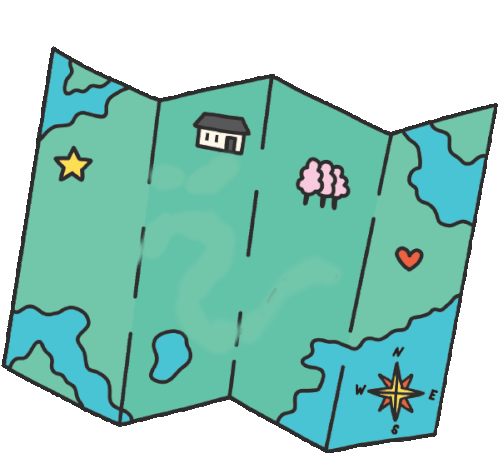

# CODECHEF VIT BHOPAL CHAPTER

**Contents:**
  - [About](#about)
  - [Development](#development)
  - [Roadmap](#roadmap)
  - [Authors](#authors)
---

##  About
This is the repository of the official website for **Codechef VIT Bhopal Chapter** hosted at [codechefvitbhopal.tech](https://codechefvitbhopal.tech).
CodeChef VIT Bhopal Chapter is a programming club run and maintained by the official chapter leaders and mentored by [CodeChef](https://www.codechef.com). The chapter drives to make learning competitive programming accessible to students. The chapter aims to make [VIT Bhopal’s](https://vitbhopal.ac.in) coding culture the very best. The community emphasizes smoothing coding skills, data structures, and algorithmic knowledge of the club members and students alike.
 
 

##  Development
This website is built using [Firebase](https://firebase.google.com) by Google, complimented with [Next.js](https://nextjs.org), a [React](https://reactjs.org) framework.

To learn more about them, take a look at the following resources:

* [Firebase Documentation](https://firebase.google.com/docs) -- learn about what Firebase products offer. 
* [React Documentation](https://reactjs.org/docs/getting-started.html) -- learn about how to use React. 
* [Next.js Documentation](https://nextjs.org/docs) - learn about Next.js features and API.

 

###  **Tools Used**
<svg xmlns="http://www.w3.org/2000/svg" width="40px" viewBox="0 0 128 128"><path fill="#E44D26" d="M9.032 2l10.005 112.093 44.896 12.401 45.02-12.387L118.968 2H9.032zm89.126 26.539l-.627 7.172L97.255 39H44.59l1.257 14h50.156l-.336 3.471-3.233 36.119-.238 2.27L64 102.609v.002l-.034.018-28.177-7.423L33.876 74h13.815l.979 10.919L63.957 89H64v-.546l15.355-3.875L80.959 67H33.261l-3.383-38.117L29.549 25h68.939l-.33 3.539z"/></svg>
<svg xmlns="http://www.w3.org/2000/svg" width="40px" viewBox="0 0 128 128"><path fill="#1572B6" d="M8.76 1l10.055 112.883 45.118 12.58 45.244-12.626L119.24 1H8.76zm89.591 25.862l-3.347 37.605.01.203-.014.467v-.004l-2.378 26.294-.262 2.336L64 101.607v.001l-.022.019-28.311-7.888L33.75 72h13.883l.985 11.054 15.386 4.17-.004.008v-.002l15.443-4.229L81.075 65H48.792l-.277-3.043-.631-7.129L47.553 51h34.749l1.264-14H30.64l-.277-3.041-.63-7.131L29.401 23h69.281l-.331 3.862z"/></svg>
<svg xmlns="http://www.w3.org/2000/svg" width="40px" viewBox="0 0 128 128"><path fill="#F0DB4F" d="M2 1v125h125V1H2zm66.119 106.513c-1.845 3.749-5.367 6.212-9.448 7.401-6.271 1.44-12.269.619-16.731-2.059-2.986-1.832-5.318-4.652-6.901-7.901l9.52-5.83c.083.035.333.487.667 1.071 1.214 2.034 2.261 3.474 4.319 4.485 2.022.69 6.461 1.131 8.175-2.427 1.047-1.81.714-7.628.714-14.065C58.433 78.073 58.48 68 58.48 58h11.709c0 11 .06 21.418 0 32.152.025 6.58.596 12.446-2.07 17.361zm48.574-3.308c-4.07 13.922-26.762 14.374-35.83 5.176-1.916-2.165-3.117-3.296-4.26-5.795 4.819-2.772 4.819-2.772 9.508-5.485 2.547 3.915 4.902 6.068 9.139 6.949 5.748.702 11.531-1.273 10.234-7.378-1.333-4.986-11.77-6.199-18.873-11.531-7.211-4.843-8.901-16.611-2.975-23.335 1.975-2.487 5.343-4.343 8.877-5.235l3.688-.477c7.081-.143 11.507 1.727 14.756 5.355.904.916 1.642 1.904 3.022 4.045-3.772 2.404-3.76 2.381-9.163 5.879-1.154-2.486-3.069-4.046-5.093-4.724-3.142-.952-7.104.083-7.926 3.403-.285 1.023-.226 1.975.227 3.665 1.273 2.903 5.545 4.165 9.377 5.926 11.031 4.474 14.756 9.271 15.672 14.981.882 4.916-.213 8.105-.38 8.581z"/></svg>
<svg xmlns="http://www.w3.org/2000/svg" width="40px" viewBox="0 0 128 128" ><g fill="#61DAFB"><circle cx="64" cy="64" r="11.4"/><path d="M107.3 45.2c-2.2-.8-4.5-1.6-6.9-2.3.6-2.4 1.1-4.8 1.5-7.1 2.1-13.2-.2-22.5-6.6-26.1-1.9-1.1-4-1.6-6.4-1.6-7 0-15.9 5.2-24.9 13.9-9-8.7-17.9-13.9-24.9-13.9-2.4 0-4.5.5-6.4 1.6-6.4 3.7-8.7 13-6.6 26.1.4 2.3.9 4.7 1.5 7.1-2.4.7-4.7 1.4-6.9 2.3C8.2 50 1.4 56.6 1.4 64s6.9 14 19.3 18.8c2.2.8 4.5 1.6 6.9 2.3-.6 2.4-1.1 4.8-1.5 7.1-2.1 13.2.2 22.5 6.6 26.1 1.9 1.1 4 1.6 6.4 1.6 7.1 0 16-5.2 24.9-13.9 9 8.7 17.9 13.9 24.9 13.9 2.4 0 4.5-.5 6.4-1.6 6.4-3.7 8.7-13 6.6-26.1-.4-2.3-.9-4.7-1.5-7.1 2.4-.7 4.7-1.4 6.9-2.3 12.5-4.8 19.3-11.4 19.3-18.8s-6.8-14-19.3-18.8zM92.5 14.7c4.1 2.4 5.5 9.8 3.8 20.3-.3 2.1-.8 4.3-1.4 6.6-5.2-1.2-10.7-2-16.5-2.5-3.4-4.8-6.9-9.1-10.4-13 7.4-7.3 14.9-12.3 21-12.3 1.3 0 2.5.3 3.5.9zM81.3 74c-1.8 3.2-3.9 6.4-6.1 9.6-3.7.3-7.4.4-11.2.4-3.9 0-7.6-.1-11.2-.4-2.2-3.2-4.2-6.4-6-9.6-1.9-3.3-3.7-6.7-5.3-10 1.6-3.3 3.4-6.7 5.3-10 1.8-3.2 3.9-6.4 6.1-9.6 3.7-.3 7.4-.4 11.2-.4 3.9 0 7.6.1 11.2.4 2.2 3.2 4.2 6.4 6 9.6 1.9 3.3 3.7 6.7 5.3 10-1.7 3.3-3.4 6.6-5.3 10zm8.3-3.3c1.5 3.5 2.7 6.9 3.8 10.3-3.4.8-7 1.4-10.8 1.9 1.2-1.9 2.5-3.9 3.6-6 1.2-2.1 2.3-4.2 3.4-6.2zM64 97.8c-2.4-2.6-4.7-5.4-6.9-8.3 2.3.1 4.6.2 6.9.2 2.3 0 4.6-.1 6.9-.2-2.2 2.9-4.5 5.7-6.9 8.3zm-18.6-15c-3.8-.5-7.4-1.1-10.8-1.9 1.1-3.3 2.3-6.8 3.8-10.3 1.1 2 2.2 4.1 3.4 6.1 1.2 2.2 2.4 4.1 3.6 6.1zm-7-25.5c-1.5-3.5-2.7-6.9-3.8-10.3 3.4-.8 7-1.4 10.8-1.9-1.2 1.9-2.5 3.9-3.6 6-1.2 2.1-2.3 4.2-3.4 6.2zM64 30.2c2.4 2.6 4.7 5.4 6.9 8.3-2.3-.1-4.6-.2-6.9-.2-2.3 0-4.6.1-6.9.2 2.2-2.9 4.5-5.7 6.9-8.3zm22.2 21l-3.6-6c3.8.5 7.4 1.1 10.8 1.9-1.1 3.3-2.3 6.8-3.8 10.3-1.1-2.1-2.2-4.2-3.4-6.2zM31.7 35c-1.7-10.5-.3-17.9 3.8-20.3 1-.6 2.2-.9 3.5-.9 6 0 13.5 4.9 21 12.3-3.5 3.8-7 8.2-10.4 13-5.8.5-11.3 1.4-16.5 2.5-.6-2.3-1-4.5-1.4-6.6zM7 64c0-4.7 5.7-9.7 15.7-13.4 2-.8 4.2-1.5 6.4-2.1 1.6 5 3.6 10.3 6 15.6-2.4 5.3-4.5 10.5-6 15.5C15.3 75.6 7 69.6 7 64zm28.5 49.3c-4.1-2.4-5.5-9.8-3.8-20.3.3-2.1.8-4.3 1.4-6.6 5.2 1.2 10.7 2 16.5 2.5 3.4 4.8 6.9 9.1 10.4 13-7.4 7.3-14.9 12.3-21 12.3-1.3 0-2.5-.3-3.5-.9zM96.3 93c1.7 10.5.3 17.9-3.8 20.3-1 .6-2.2.9-3.5.9-6 0-13.5-4.9-21-12.3 3.5-3.8 7-8.2 10.4-13 5.8-.5 11.3-1.4 16.5-2.5.6 2.3 1 4.5 1.4 6.6zm9-15.6c-2 .8-4.2 1.5-6.4 2.1-1.6-5-3.6-10.3-6-15.6 2.4-5.3 4.5-10.5 6-15.5 13.8 4 22.1 10 22.1 15.6 0 4.7-5.8 9.7-15.7 13.4z"/></g></svg>
<svg xmlns="http://www.w3.org/2000/svg" width="40px" viewBox="0 0 128 128"><path d="M64 0C28.7 0 0 28.7 0 64s28.7 64 64 64 64-28.7 64-64S99.3 0 64 0zm32.7 114.4L48.4 41.8h-6.8v50.1h6.8V55.3l44.2 61.5c-8.5 4.6-18.2 7.2-28.6 7.2-33.2.1-60.1-26.8-60.1-60S30.8 3.9 64 3.9s60.1 26.9 60.1 60.1c0 21.1-10.9 39.7-27.4 50.4z"/><path d="M78.6 73.3l7.5 11.3V41.8h-7.5z"/></svg>
<svg xmlns="http://www.w3.org/2000/svg" width="40px" viewBox="0 0 128 128"><path fill="#f58220" d="M27.35 80.52l10.68-68.44c.37-2.33 3.5-2.89 4.6-.8l11.48 21.48-26.76 47.76zm75.94 16.63L93.1 34.11c-.31-1.96-2.76-2.76-4.17-1.35L24.71 97.15l35.54 19.95a7.447 7.447 0 007.18 0l35.86-19.95zm-28.85-55L66.21 26.5c-.92-1.78-3.44-1.78-4.36 0L25.7 90.95l48.74-48.8z"/></svg>
<svg xmlns="http://www.w3.org/2000/svg" width="40px" viewBox="0 0 128 128"><path fill="#F34F29" d="M124.742 58.378L69.625 3.264c-3.172-3.174-8.32-3.174-11.497 0L46.685 14.71l14.518 14.518c3.375-1.139 7.243-.375 9.932 2.314a9.66 9.66 0 012.293 9.993L87.42 55.529c3.385-1.167 7.292-.413 9.994 2.295 3.78 3.777 3.78 9.9 0 13.679a9.673 9.673 0 01-13.683 0 9.677 9.677 0 01-2.105-10.521L68.578 47.933l-.002 34.341a9.708 9.708 0 012.559 1.828c3.779 3.777 3.779 9.898 0 13.683-3.779 3.777-9.904 3.777-13.679 0-3.778-3.784-4.088-9.905-.311-13.683.934-.933 1.855-1.638 2.855-2.11V47.333c-1-.472-1.92-1.172-2.856-2.111-2.861-2.86-3.396-7.06-1.928-10.576L40.983 20.333 3.229 58.123c-3.175 3.177-3.155 8.325.02 11.5l55.126 55.114c3.173 3.174 8.325 3.174 11.503 0l54.86-54.858c3.175-3.176 3.178-8.327.004-11.501z"/></svg>
<svg xmlns="http://www.w3.org/2000/svg" width="40px" viewBox="0 0 128 128"><g fill="#181616"><path fill-rule="evenodd" clip-rule="evenodd" d="M64 5.103c-33.347 0-60.388 27.035-60.388 60.388 0 26.682 17.303 49.317 41.297 57.303 3.017.56 4.125-1.31 4.125-2.905 0-1.44-.056-6.197-.082-11.243-16.8 3.653-20.345-7.125-20.345-7.125-2.747-6.98-6.705-8.836-6.705-8.836-5.48-3.748.413-3.67.413-3.67 6.063.425 9.257 6.223 9.257 6.223 5.386 9.23 14.127 6.562 17.573 5.02.542-3.903 2.107-6.568 3.834-8.076-13.413-1.525-27.514-6.704-27.514-29.843 0-6.593 2.36-11.98 6.223-16.21-.628-1.52-2.695-7.662.584-15.98 0 0 5.07-1.623 16.61 6.19C53.7 35 58.867 34.327 64 34.304c5.13.023 10.3.694 15.127 2.033 11.526-7.813 16.59-6.19 16.59-6.19 3.287 8.317 1.22 14.46.593 15.98 3.872 4.23 6.215 9.617 6.215 16.21 0 23.194-14.127 28.3-27.574 29.796 2.167 1.874 4.097 5.55 4.097 11.183 0 8.08-.07 14.583-.07 16.572 0 1.607 1.088 3.49 4.148 2.897 23.98-7.994 41.263-30.622 41.263-57.294C124.388 32.14 97.35 5.104 64 5.104z"/><path d="M26.484 91.806c-.133.3-.605.39-1.035.185-.44-.196-.685-.605-.543-.906.13-.31.603-.395 1.04-.188.44.197.69.61.537.91zm2.446 2.729c-.287.267-.85.143-1.232-.28-.396-.42-.47-.983-.177-1.254.298-.266.844-.14 1.24.28.394.426.472.984.17 1.255zM31.312 98.012c-.37.258-.976.017-1.35-.52-.37-.538-.37-1.183.01-1.44.373-.258.97-.025 1.35.507.368.545.368 1.19-.01 1.452zm3.261 3.361c-.33.365-1.036.267-1.552-.23-.527-.487-.674-1.18-.343-1.544.336-.366 1.045-.264 1.564.23.527.486.686 1.18.333 1.543zm4.5 1.951c-.147.473-.825.688-1.51.486-.683-.207-1.13-.76-.99-1.238.14-.477.823-.7 1.512-.485.683.206 1.13.756.988 1.237zm4.943.361c.017.498-.563.91-1.28.92-.723.017-1.308-.387-1.315-.877 0-.503.568-.91 1.29-.924.717-.013 1.306.387 1.306.88zm4.598-.782c.086.485-.413.984-1.126 1.117-.7.13-1.35-.172-1.44-.653-.086-.498.422-.997 1.122-1.126.714-.123 1.354.17 1.444.663zm0 0"/></g></svg>
 
 

##  Roadmap
The CODECHEF VIT BHOPAL CHAPTER is a growing community with a talented and strong team. The community has conducted numerous *[events](https://codechefvitbhopal.tech/Events/)* in the past and we do not wish to settle anytime soon. We have a plethora of fun and informative sessions and competitions lined up. As more and more crew members join this massive ship, the chapter sails forward to being the biggest and best programming community at VIT Bhopal.
 
 

##  Authors
The pillars of this website rest upon the firm shoulders of the talented Website Team. It is their tireless and devoted efforts that keep the website up and running.
 